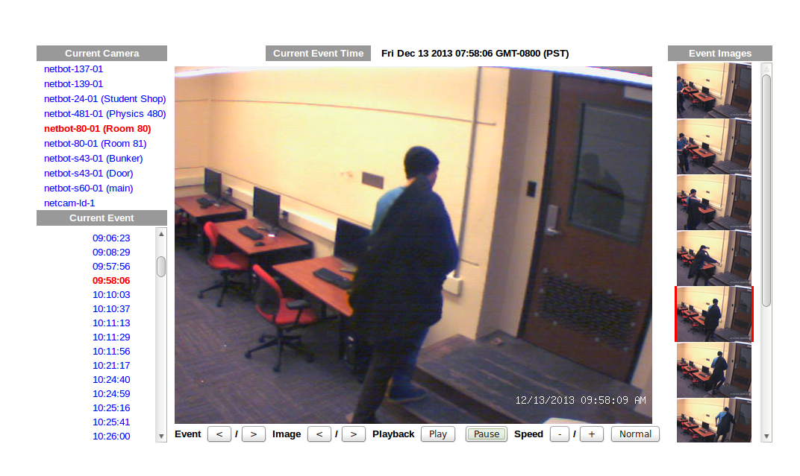

cameraz
=======

Accepts http post images from Netbotz and Axis camera motion detection events, stores and displays them with simple javascript interface

Screenshot
----------

Install
=======

Extract somewhere where you keep your web files, like /var/lib/www/cameraz/

Setup an alias in your webserver (apache example here) like this:

    Alias /cameraz /var/lib/www/cameraz/docs
    <Directory /var/lib/www/cameraz/docs>
      DirectoryIndex index.php
      Order allow,deny
      Allow from all 
    </Directory>
    
    # If you want to put the data (jpg files) in a better place, this will 
    # corrispond to the $IMAGE_BASE_DIRECTORY 
    # field in the config.
    # (uncomment following line if you move it, otherwise relative path works anyway)
    #Alias /cameraz/data /var/lib/www/cameraz/data
    <Directory /var/lib/www/cameraz/data>
      #Because its writable to the web-user, absolutely dont execute php code from it!
      php_flag engine off
      Order allow,deny
      Allow from all 
    </Directory>

Copy config.php.example to config.php and set the paths up correctly.

Make sure the data directory is writable to the web-server user:
    sudo chown -R www-data /var/lib/www/cameraz/data

you can test it out by enabling some debug code. It writes debug log to /tmp but don't leave
it enabled or you will fill it up.

Note there is no security in the above example configuration. I suggest adding http auth 
or keeping behind a firewall or something. That is up to you to figure out...

Now you need to set up the camera to 'post' to the application. Config varies by camera. 

The different php files are for different cameras. We could use some contributions in this area
to figure out what works and with what. But here is my guess:

  netcam.php - axis network cameras
  oldnetbot.php - old old netbots such as 320
  post.php - modern netbots such as 500
  test.php - helpful file for debugging...

finally, the index.php provides the UI to viewing the recorded images. Good luck!
